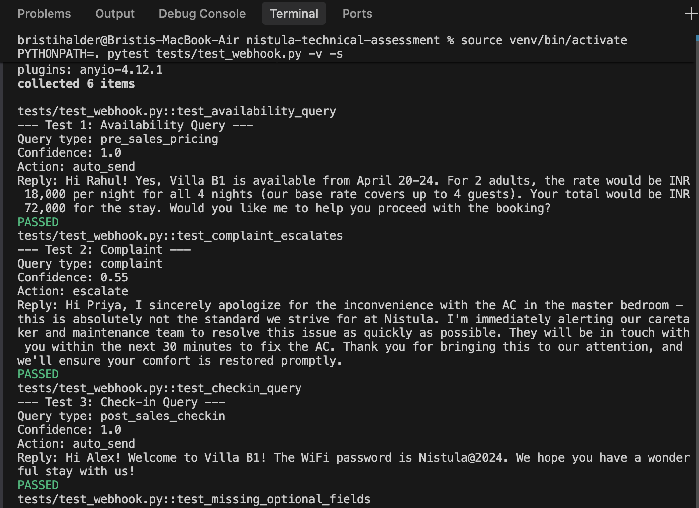
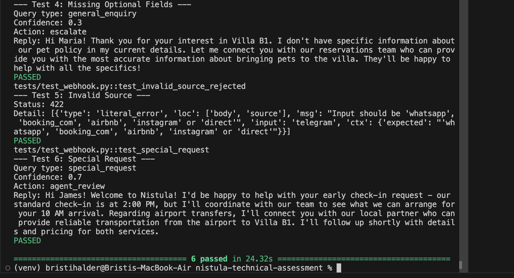
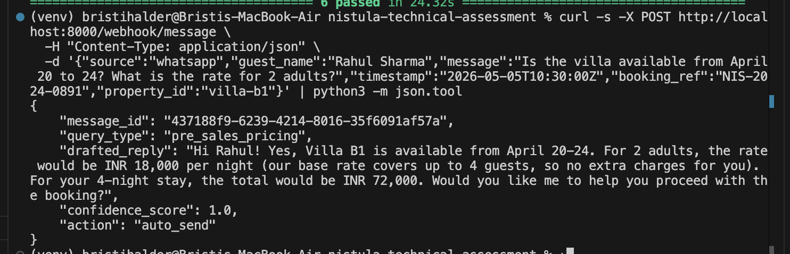

#Guest Message Handler

A backend system that receives guest messages from multiple channels, normalises them into a unified schema, classifies the query type, and uses Claude AI to draft context-aware replies with confidence scoring.

## Quick Start

### Prerequisites
- Python 3.11+
- An Anthropic API key

### Setup

```bash
# Clone the repository
git clone https://github.com/your-username/nistula-technical-assessment.git
cd nistula-technical-assessment

# Create virtual environment
python3 -m venv venv
source venv/bin/activate

# Install dependencies
pip install -r requirements.txt

# Configure environment variables
cp .env.example .env
# Edit .env and add your ANTHROPIC_API_KEY
```

### Run the server

```bash
uvicorn src.main:app --reload --port 8000
```

The server starts at `http://localhost:8000`. API docs are available at `http://localhost:8000/docs`.

### Test the endpoint

```bash
curl -X POST http://localhost:8000/webhook/message \
  -H "Content-Type: application/json" \
  -d '{
    "source": "whatsapp",
    "guest_name": "Rahul Sharma",
    "message": "Is the villa available from April 20 to 24? What is the rate for 2 adults?",
    "timestamp": "2026-05-05T10:30:00Z",
    "booking_ref": "NIS-2024-0891",
    "property_id": "villa-b1"
  }'
```

### Run tests

```bash
pytest tests/ -v
```

> **Note:** Tests make real Claude API calls. Ensure `ANTHROPIC_API_KEY` is set in `.env`.

---
 
## Demo
 
### All 6 tests passing

<br/>

All 6 integration tests pass in ~24s, covering availability queries, complaint escalation, check-in queries, missing optional fields, invalid source rejection, and special requests.
 
### Live server response
 

A real request to the running server — Rahul's availability + pricing query is classified as `pre_sales_pricing`, a reply is drafted with the correct nightly rate and 4-night total, and the confidence score of `1.0` triggers an `auto_send` action.

## Architecture

```
POST /webhook/message
        │
        ▼
┌─────────────────┐
│   Normaliser     │  Converts channel payload → unified schema
│  (normaliser.py) │  Generates UUID, maps field names
└────────┬────────┘
         │
         ▼
┌─────────────────┐
│  Property Context│  Loads villa details for the AI prompt
│(property_context)│  Falls back to default if property_id unknown
└────────┬────────┘
         │
         ▼
┌─────────────────┐
│   AI Handler     │  Single Claude API call:
│  (ai_handler.py) │  classifies query + drafts reply + scores confidence
└────────┬────────┘
         │
         ▼
┌─────────────────┐
│   Confidence     │  Applies rule-based adjustments
│ (confidence.py)  │  Determines action (auto_send/agent_review/escalate)
└────────┬────────┘
         │
         ▼
    JSON Response
```

### Key Design Decisions

1. **Single AI call for classification + reply**: Instead of making two separate Claude calls (one to classify, one to draft), both tasks are handled in a single prompt. This halves latency and API cost while maintaining accuracy — Claude receives the full context for both tasks simultaneously.

2. **Keyword classifier as hint, not authority**: A local keyword-based classifier (`classifier.py`) provides a quick initial guess that's included in the Claude prompt as a hint. Claude makes the final classification decision. This improves accuracy on ambiguous messages while providing a fallback if the AI response can't be parsed.

3. **Graceful degradation**: If Claude's JSON response can't be parsed, the system falls back to the keyword classification and uses the raw AI text as the reply with a low confidence score (triggering agent review). The endpoint never crashes on AI failures — it returns a 503 with retry guidance.

---

## Confidence Scoring Logic

The confidence score determines whether a reply is auto-sent, reviewed by a human, or escalated. It combines two signals:

### Signal 1: Claude's Self-Assessment (Base Score)

Claude rates its own confidence from 0.0 to 1.0 based on:
- **Information completeness**: Does the property context contain all the info needed to answer?
- **Assumption level**: Did the AI need to make assumptions or inferences?
- **Query clarity**: Is the guest's intent clear or ambiguous?

### Signal 2: Rule-Based Adjustments

Business logic adjustments are applied on top of Claude's score:

| Rule | Adjustment | Rationale |
|------|-----------|-----------|
| Query is a **complaint** | Capped at **0.55** | Complaints involve refunds, compensation, and emotional situations — always needs human judgement |
| Guest has a **booking_ref** on a pre-sales query | Boosted by **+0.05** | Returning guests provide more context (booking history), making answers more reliable |

### Action Thresholds

| Score Range | Action | What Happens |
|-------------|--------|-------------|
| > 0.85 | `auto_send` | Reply is sent to the guest automatically |
| 0.60 – 0.85 | `agent_review` | Reply is queued for a human agent to review/edit before sending |
| < 0.60 | `escalate` | Flagged as needing human attention |
| Any score + complaint | `escalate` | Complaints always escalate regardless of confidence |

### Why This Approach?

- **Claude's self-assessment** captures *information-level* confidence — whether the answer is factually grounded in the property context.
- **Rule-based adjustments** capture *business-level* policy — complaints should never be auto-sent, even if the AI knows exactly what to say, because the *decision* to offer a refund isn't the AI's to make.
- The separation means the AI can be confidently correct about a complaint (e.g., "yes, I know the AC is broken and I should apologise") while the system still routes it to a human for resolution.

---

## Project Structure

```
├── README.md                  ← You are here
├── .env.example               ← Environment variable template
├── requirements.txt           ← Python dependencies
├── schema.sql                 ← Part 2: PostgreSQL schema
├── thinking.md                ← Part 3: Thinking question answers
├── src/
│   ├── main.py                ← FastAPI app + webhook endpoint
│   ├── models.py              ← Pydantic models (request/response)
│   ├── normaliser.py          ← Payload → unified schema
│   ├── classifier.py          ← Keyword-based query hints
│   ├── ai_handler.py          ← Claude API integration
│   ├── confidence.py          ← Scoring logic + action rules
│   ├── property_context.py    ← Mock property data
│   └── config.py              ← Environment configuration
└── tests/
    └── test_webhook.py        ← Integration tests (6 cases)
```

---

## API Reference

### `POST /webhook/message`

**Request:**
```json
{
  "source": "whatsapp",
  "guest_name": "Rahul Sharma",
  "message": "Is the villa available from April 20 to 24?",
  "timestamp": "2026-05-05T10:30:00Z",
  "booking_ref": "NIS-2024-0891",
  "property_id": "villa-b1"
}
```

| Field | Type | Required | Notes |
|-------|------|----------|-------|
| source | string | Yes | One of: `whatsapp`, `booking_com`, `airbnb`, `instagram`, `direct` |
| guest_name | string | Yes | |
| message | string | Yes | |
| timestamp | ISO 8601 | Yes | |
| booking_ref | string | No | Existing booking reference |
| property_id | string | No | Defaults to `villa-b1` |

**Response:**
```json
{
  "message_id": "550e8400-e29b-41d4-a716-446655440000",
  "query_type": "pre_sales_availability",
  "drafted_reply": "Hi Rahul! Great news — Villa B1 is available from April 20 to 24...",
  "confidence_score": 0.92,
  "action": "auto_send"
}
```

### `GET /health`

Returns `{"status": "healthy", "service": "nistula-message-handler"}`.

---

## Error Handling

| Status | Scenario | Response |
|--------|----------|----------|
| 422 | Invalid payload (bad source, missing fields) | Pydantic validation error details |
| 503 | Claude API failure | `{"error": "AI service temporarily unavailable", ...}` |
| 500 | Unexpected server error | `{"error": "Internal server error", ...}` |
